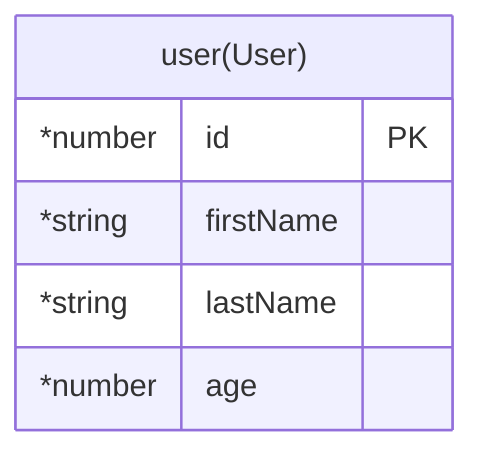

# test

## Table Of Contents

1. 0.0.1 Entities
   1. user(User)
2. ER Diagram

## 0.0.1 Entities

### user(User)

#### user(User) columns

| Database Name | Property Name | Attribute | Type     | Nullable | Charset | Comment |
| ------------- | ------------- | --------- | -------- | -------- | ------- | ------- |
| id            | id            | PK        | \*number |          |         |         |
| firstName     | firstName     |           | \*string |          |         |         |
| lastName      | lastName      |           | \*string |          |         |         |
| age           | age           |           | \*number |          |         |         |

## ER Diagram

